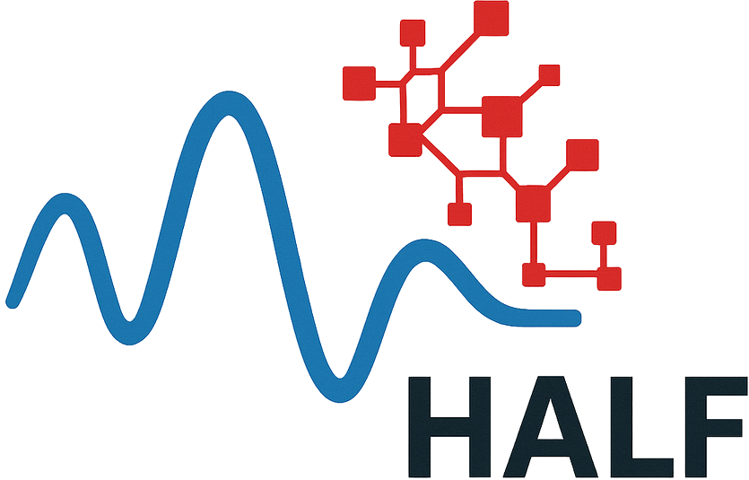

  

Our goal is to tackle pivotal and long-standing open problems in harmonic analysis, and formalize their proofs in real-time at the University of Bonn.

This shows that it is feasible for mathematicians to verify the correctness of their own proofs.

Challenges in harmonic analysis:
* Find estimates for multilinear singular integrals;
<!-- prove that the triangular Hilbert form satisfies singular Brascamp-Lieb estimates -->
* Find new estimates and convergence results for Ergodic averages;
<!-- prove pointwise convergence of ergodic averages for two commuting transformations -->
* Develop nonlinear analogue of Carleson's theorem.

Our formalization will use [Lean](https://lean-lang.org/) and [Mathlib](https://leanprover-community.github.io/).

## News

* We will start this project in April 2026.

## Team

### Principal Investigators

* [Floris van Doorn](https://florisvandoorn.com)
* [Christoph Thiele](https://www.math.uni-bonn.de/~thiele/)

<!-- Visitor: Joris Roos -->

### Postdocs

* [Tainara Borges](https://sites.google.com/brown.edu/tainaraborgeswebpage/home) (starting Summer 2026)
* [Stefanos Lappas](https://sites.google.com/view/stefanos-lappas/) (starting Spring 2026)
* [Leopold Mayer](https://math.washington.edu/people/leopold-mayer) (starting Fall 2026)
* [Michael Rothgang](https://www.math.uni-bonn.de/people/rothgang/)

### PhD Students

* [Lua Viana Reis](https://github.com/lua-vr) (starting Spring 2026)

### Visiting Researchers

* [Polona Durcik](https://www.chapman.edu/our-faculty/polona-durcik.aspx) (starting Summer 2026)
* [Joris Roos](https://www.uml.edu/profile/joris_roos) (starting Spring 2026)

## Jobs

* We are looking for PhD candidates to join our project! You can apply via the [BIGS website](https://www.mathematics.uni-bonn.de/hsm-school/phd-admission/phd-admission) (in April or November)
* We are looking for student research assistants to join the Lean formalization effort. Contact Floris van Doorn if you are interested (only available for students in Bonn).

<!-- add member photos -->

<!--    -->
